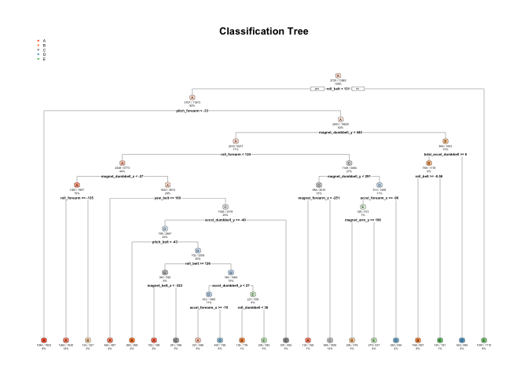

##### Written by Yi on Apr 21, 2020.

##### Background/Data/Instructions
###### Please refer to the Practical Machine Learning website at coursera: https://www.coursera.org/learn/practical-machine-learning/peer/R43St/prediction-assignment-writeup

#### Analysis
##### Reproduceability
###### To ensure reprodiceabilitity, we use set.seed = 777 for all pseudo-random number generated from this dataset. Hope this number will give us some good luck.
###### Additionally, this work is performed under macOS Catalina version 10.15.3. The sysname of R is "Darwin" and the release version is "19.3.0". The R studio is under Version 1.2.5033. All packages used in this work are up-to-date versions (as of Apr 21, 2020).

##### Describing the Model
###### As described in the explanation document, the outcome variable is a factor variable including 5 different classes (class A, B, C, D, E). While class A the expected outcome (aka correct), all the other 4 classes are not as expected (aka wrong). Here are the five classes for more information: 
###### Class A: exactly according to the specification
###### Class B: throwing the elbows to the front
###### Class C: lifting the dumbbell only halfway
###### Class D: lowering the dumbbell only halfway
###### Class E: throwing the hips to the front
###### Additionally, this dataset contains a lot of NA values that needs to be cleaned before performing the analysis.
###### I will use two different models to test this data set: Decision Tree and Random Forest algorithms. As expected, the model with the highest accuracy will be chosen as the final model.

##### Cross-Validation
###### Since the training data set is huge (nearly 20,000 obs), we can subsample our training data set into two subsets, namely subTraining dataset (66.7%) and subTesting dataset (33.3%). We will train our model with subTraining and then test on subTesting. We will compare the two predicition models, the one with the higher accuracy will be choosen to be tested on the original Testing dataset.

##### Expected Out-of-Sample Error
###### The expected out-of-sample error will be the number of cases found in the cross-validation dataset, and its rate described as the percentage of 1-accuracy.

##### Explaination of my Choice
###### My work can be abbreviated as follows: 1. Our training data set is large enough for us to sub-divide into subtraining and subtesting for corss-validation. 2. Our outcome variable is a type of factor variable, so we can choose error type as 1-accuracy. 3. All irrelevant and missing variables will be removed. 4. All other relevant variables will be left for analysis. 5. I will use both Decision Tree and Random forest algorithms to perform classification, as these two are known for detecting features for classification. 6. Random seed will be set at 777 to ensure the subsetting part is reproduceable.


#### Result
##### Step 0, load libraries and set seeds for reproduceability.

```r
library(caret); library(randomForest); library(rpart); library (rpart.plot)
```

```
## Loading required package: lattice
```

```
## Loading required package: ggplot2
```

```
## randomForest 4.6-14
```

```
## Type rfNews() to see new features/changes/bug fixes.
```

```
## 
## Attaching package: 'randomForest'
```

```
## The following object is masked from 'package:ggplot2':
## 
##     margin
```

```r
set.seed(777)
```
##### Step 1, download and tidy the data by removing missing and irrelavant contents.

```r
## 1.1 Download the dataset
TrainUrl <- "http://d396qusza40orc.cloudfront.net/predmachlearn/pml-training.csv"
TestUrl <- "http://d396qusza40orc.cloudfront.net/predmachlearn/pml-testing.csv"
## 1.2 Remove the na.strings so that the file can be read properly
Training <- read.csv(url(TrainUrl), na.strings=c("NA","#DIV/0!",""))
Testing <- read.csv(url(TestUrl), na.strings=c("NA","#DIV/0!",""))
## 1.3 Remove the columns with missing values
Training<-Training[,colSums(is.na(Training)) == 0]
Testing <-Testing[,colSums(is.na(Testing)) == 0]
## 1.4 Remove irrevalant contents from column 1-7 (name, time, window, etc).
Training <- Training[,-c(1:7)]
Testing <- Testing[,-c(1:7)]
```
###### To save the space here, I skipped the data checking step. You can perform this by doing dim(), head(), str(), etc.

##### Step 2, Dividing the Training data set for Cross-Validation
###### As I described, the training dataset is huge with 19622 obs (>>30 obs), we can divide this Training dataset into subTraining and subTesting for cross-validation. I will use 2/3 (0.67) for subTraining and 1/3 for subTesting

```r
DivTraining <- createDataPartition(y=Training$classe, p=2/3, list=FALSE)
subTraining <- Training[DivTraining, ] 
subTesting <- Training[-DivTraining, ]
```

##### Step 3 Decision Tree Prediction Model
###### We will use this subTraining dataset to train and use subTesting for validation. Here, we will use DT as Decision Tree.

```r
DT <- rpart(classe ~., data=subTraining, method = "class")
rpart.plot(DT, main="Classification Tree", extra=102, under=TRUE, faclen=0)
```

<!-- -->
###### We will perform the prediction and apply it to the subTesting dataset.

```r
predictDT <- predict(DT, subTesting, type = "class")
## Then, we will show the result of the subTesing dataset.
confusionMatrix(predictDT, subTesting$classe)
```

```
## Confusion Matrix and Statistics
## 
##           Reference
## Prediction    A    B    C    D    E
##          A 1681  224   64  148   43
##          B   58  728   83  105   86
##          C   49  166  884  159  149
##          D   35   89   75  558   67
##          E   37   58   34  102  857
## 
## Overall Statistics
##                                           
##                Accuracy : 0.72            
##                  95% CI : (0.7089, 0.7308)
##     No Information Rate : 0.2844          
##     P-Value [Acc > NIR] : < 2.2e-16       
##                                           
##                   Kappa : 0.6437          
##                                           
##  Mcnemar's Test P-Value : < 2.2e-16       
## 
## Statistics by Class:
## 
##                      Class: A Class: B Class: C Class: D Class: E
## Sensitivity            0.9038   0.5755   0.7754  0.52052   0.7130
## Specificity            0.8976   0.9370   0.9031  0.95134   0.9567
## Pos Pred Value         0.7782   0.6868   0.6283  0.67718   0.7877
## Neg Pred Value         0.9591   0.9020   0.9501  0.91006   0.9367
## Prevalence             0.2844   0.1935   0.1743  0.16394   0.1838
## Detection Rate         0.2571   0.1113   0.1352  0.08533   0.1311
## Detection Prevalence   0.3303   0.1621   0.2152  0.12601   0.1664
## Balanced Accuracy      0.9007   0.7563   0.8393  0.73593   0.8348
```

##### Step 4 Random Forest Prediction Model
###### We will use this subTraining dataset to train and use subTesting for validation. Here, we will use RF as Random Forest.

```r
RF <- randomForest(classe ~., data=subTraining, method = "class")
## Random forest does not provide a good visualization solution. I tried several alternative solutions but the plots are too compacted. As a result, the plot is skipped. For more information, please try ggRandomForests and/or getTree().
predictRF <- predict(RF, subTesting, type = "class")
## Then, we will show the result of the subTesing dataset.
confusionMatrix(predictRF, subTesting$classe)
```

```
## Confusion Matrix and Statistics
## 
##           Reference
## Prediction    A    B    C    D    E
##          A 1858    2    0    0    0
##          B    0 1261    4    0    0
##          C    0    2 1136   12    0
##          D    0    0    0 1060    9
##          E    2    0    0    0 1193
## 
## Overall Statistics
##                                           
##                Accuracy : 0.9953          
##                  95% CI : (0.9933, 0.9968)
##     No Information Rate : 0.2844          
##     P-Value [Acc > NIR] : < 2.2e-16       
##                                           
##                   Kappa : 0.994           
##                                           
##  Mcnemar's Test P-Value : NA              
## 
## Statistics by Class:
## 
##                      Class: A Class: B Class: C Class: D Class: E
## Sensitivity            0.9989   0.9968   0.9965   0.9888   0.9925
## Specificity            0.9996   0.9992   0.9974   0.9984   0.9996
## Pos Pred Value         0.9989   0.9968   0.9878   0.9916   0.9983
## Neg Pred Value         0.9996   0.9992   0.9993   0.9978   0.9983
## Prevalence             0.2844   0.1935   0.1743   0.1639   0.1838
## Detection Rate         0.2841   0.1928   0.1737   0.1621   0.1824
## Detection Prevalence   0.2844   0.1935   0.1759   0.1635   0.1827
## Balanced Accuracy      0.9992   0.9980   0.9969   0.9936   0.9961
```

#### Conclusion
###### As we can see, the accuracy of Decision Tree is 0.7200 with 95% CI (0.7089, 0.7308) and the accuracy of Random Forest is 0.9956 with 95% CI (0.9936, 0.9997). Clearly, the Random Forest is better at predicting the model, so we will ues this model to predict our testing dataset.
###### In terms of out-of-sample error, since it is 1-accuracy = 1 - 0.9956 = 0.0044, which is reasonably small, we can conclude that our test dataset is highly unlikely to be miss-classified.

##### Step 5 Predict the testing data set. (Aka Quiz)

```r
## Everything else is about the same as predicting the subTesting dataset, except that we are now using the real Testing data set.
predictTesting <- predict(RF, Testing, type = "class")
predictTesting
```

```
##  1  2  3  4  5  6  7  8  9 10 11 12 13 14 15 16 17 18 19 20 
##  B  A  B  A  A  E  D  B  A  A  B  C  B  A  E  E  A  B  B  B 
## Levels: A B C D E
```
###### This will be the answer for the quiz.

